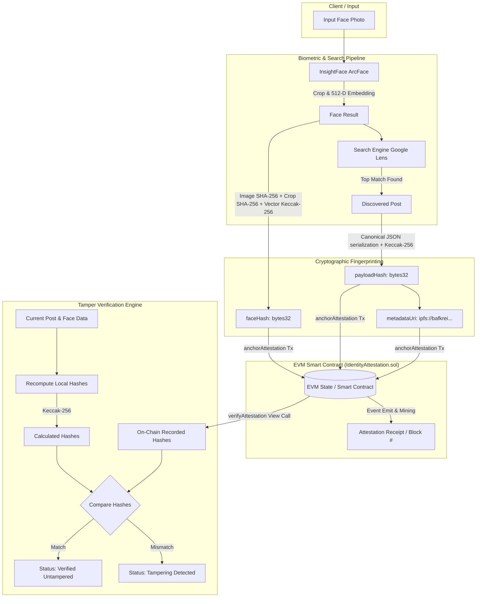
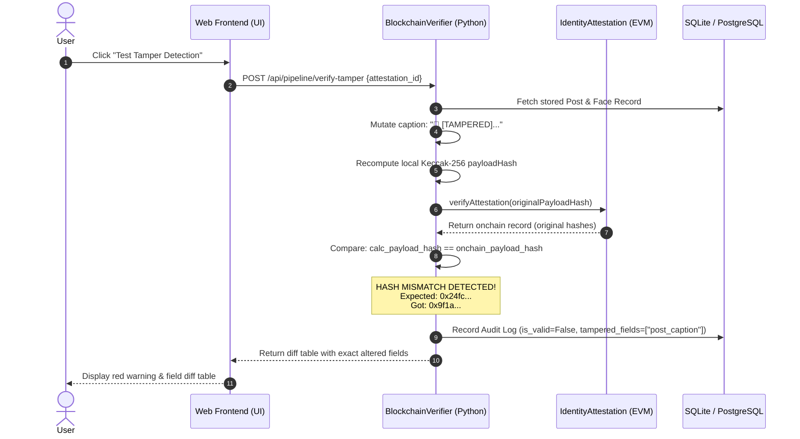

# Blockchain Verification & Attestation Architecture

This document provides a comprehensive technical breakdown of the blockchain architecture, cryptographic fingerprinting, smart contract mechanics, and tamper-detection pipeline implemented in this project.

---

## 1. Executive Summary & Problem Statement

### The Problem
When performing biometric face recognition and web-scale media discovery:
1. **Mutable Centralized Storage**: Traditional databases (SQL, MongoDB) can be silently modified, compromised by attackers, or altered by database administrators without leaving an auditable trail.
2. **Biometric & Media Forgery**: Captions, timestamps, author handles, and even facial vectors can be manipulated to forge identity claims or frame individuals.
3. **No Independent Proof of Time**: Without a decentralized timestamp authority, there is no cryptographic proof that a match existed at a specific point in time.

### The Solution: Blockchain Attestation
By anchoring cryptographic fingerprints of both the **biometric facial identity** and the **discovered online media** into an immutable EVM smart contract, the system achieves:
- **Tamper Evidence**: Any alteration to captions, author names, URLs, or face embeddings invalidates the cryptographic match against the blockchain.
- **Proof of Existence & Timestamping**: The blockchain's consensus timestamps prove the exact block when the identity match was notarized.
- **Cryptographic Non-Repudiation**: Every record is signed with the submitter's Ethereum private key.

---

## 2. End-to-End Architectural Flow



---

## 3. Cryptographic Fingerprinting Mechanics

The system derives two 32-byte (`bytes32`) cryptographic digests before communicating with the blockchain.

### A. Payload Hash (`payloadHash`)
The `payloadHash` binds the discovered public media post.

1. **Canonicalization**: To prevent JSON key-order mismatches, the post dictionary is ordered deterministically using `canonical_json()` in `src/search/social_parser.py`:
   ```python
   def canonical_dict(self) -> Dict[str, Any]:
       return {
           "author_handle": self.author_handle or "",
           "author_name": self.author_name or "",
           "platform": self.platform or "",
           "post_caption": self.post_caption or "",
           "post_image_sha256": self.post_image_sha256 or "",
           "post_timestamp": self.post_timestamp or "",
           "post_url": self.post_url or "",
           "visual_similarity_score": round(self.visual_similarity_score, 4),
       }
   ```
2. **Keccak-256 Hashing**:
   ```python
   canonical_str = json.dumps(canonical_dict, sort_keys=True, separators=(",", ":"))
   payload_hash = "0x" + Web3.keccak(text=canonical_str).hex()
   ```
   *Impact*: Modifying even a single character in the author name, URL, or caption produces a radically different 256-bit hash.

---

### B. Facial Identity Hash (`faceHash`)
The `faceHash` binds the biometric identity:

1. **Constituent Inputs**:
   - `image_sha256`: SHA-256 of the raw uploaded image.
   - `crop_sha256`: SHA-256 of the cropped aligned face bounding box.
   - `embedding_hash`: Keccak-256 hash of the raw 512-dimensional float32 normalized vector generated by the `buffalo_l` ArcFace neural model.
2. **Keccak-256 Combination**:
   ```python
   emb_bytes = face_result.embedding.astype(np.float32).tobytes()
   emb_keccak = Web3.keccak(primitive=emb_bytes).hex()
   
   combined_fingerprint = f"{image_sha256}:{crop_sha256}:{emb_keccak}"
   face_hash = "0x" + Web3.keccak(text=combined_fingerprint).hex()
   ```
   *Impact*: Swapping the face crop or subtly altering the facial embedding vector completely invalidates the `faceHash`.

---

## 4. Smart Contract Design (`IdentityAttestation.sol`)

The project includes an EVM-compatible Solidity smart contract deployed to the blockchain network.

```solidity
// SPDX-License-Identifier: MIT
pragma solidity ^0.8.20;

contract IdentityAttestation {
    
    struct Attestation {
        bytes32 payloadHash;       // Keccak256 hash of canonical post metadata
        bytes32 faceHash;          // Keccak256 hash of facial embedding & image fingerprints
        address submitter;         // Address that signed & submitted the attestation
        uint256 blockTimestamp;    // Block timestamp when anchored
        string metadataUri;        // Decentralized storage URI (ipfs:// CID)
        bool isAnchored;           // Existence flag
    }

    mapping(bytes32 => Attestation) private _attestations;
    bytes32[] private _allPayloadHashes;

    event AttestationAnchored(
        bytes32 indexed payloadHash,
        bytes32 indexed faceHash,
        address indexed submitter,
        uint256 timestamp,
        string metadataUri
    );

    error AttestationAlreadyExists(bytes32 payloadHash);
    error AttestationNotFound(bytes32 payloadHash);

    function anchorAttestation(
        bytes32 payloadHash,
        bytes32 faceHash,
        string calldata metadataUri
    ) external returns (bytes32) {
        require(payloadHash != bytes32(0), "Invalid payload hash");
        require(faceHash != bytes32(0), "Invalid face hash");

        if (_attestations[payloadHash].isAnchored) {
            revert AttestationAlreadyExists(payloadHash);
        }

        _attestations[payloadHash] = Attestation({
            payloadHash: payloadHash,
            faceHash: faceHash,
            submitter: msg.sender,
            blockTimestamp: block.timestamp,
            metadataUri: metadataUri,
            isAnchored: true
        });

        _allPayloadHashes.push(payloadHash);

        emit AttestationAnchored(payloadHash, faceHash, msg.sender, block.timestamp, metadataUri);
        return payloadHash;
    }

    function verifyAttestation(bytes32 payloadHash)
        external
        view
        returns (
            bool exists,
            uint256 blockTimestamp,
            address submitter,
            bytes32 faceHash,
            string memory metadataUri
        )
    {
        Attestation memory record = _attestations[payloadHash];
        if (!record.isAnchored) {
            return (false, 0, address(0), bytes32(0), "");
        }
        return (true, record.blockTimestamp, record.submitter, record.faceHash, record.metadataUri);
    }
}
```

### Key Contract Guarantees
1. **Immutability**: Once an attestation is anchored, there is **no update or delete function**. It exists permanently on the ledger.
2. **Duplicate Protection**: If an attestation with the same `payloadHash` is resubmitted, the contract reverts with `AttestationAlreadyExists`.
3. **Zero-Gas Verification**: `verifyAttestation` is marked `view`. Clients, third parties, or auditors can verify attestations without paying any gas fees.

---

## 5. Dual Execution: Live Node vs. Cryptographic Simulator

The backend (`src/blockchain/anchor.py`) seamlessly operates in two modes:

| Feature | Live EVM Mode (Sepolia, Anvil, Polygon) | Cryptographic Simulator Mode |
| :--- | :--- | :--- |
| **Activation** | Set `BLOCKCHAIN_RPC_URL` & `BLOCKCHAIN_PRIVATE_KEY` in `.env` | Default fallback when live RPC is unavailable |
| **Transactions** | Signed via `eth_account`, sent via `web3.eth.send_raw_transaction` | ECDSA message signing via `account.sign_message(encode_defunct(...))` |
| **Hashing** | Real native Keccak-256 (`Web3.keccak`) | Real native Keccak-256 (`Web3.keccak`) |
| **Contract State** | Deployed EVM contract bytecode storage | Thread-safe, in-memory state dictionary |
| **Auditing & Receipt** | Full Ethereum receipt (`gasUsed`, `blockNumber`, `txHash`) | Complete simulated receipt matching EVM schemas |

---

## 6. Tamper Detection & Verification Workflow

Verification compares local state against on-chain truth.



### Tamper Diff Output Schema
When a record has been tampered with, `BlockchainVerifier.verify()` pinpoints the exact modified keys:
```json
{
  "is_valid": false,
  "onchain_record_found": true,
  "calculated_payload_hash": "0x9f1a78...",
  "onchain_payload_hash": "0x24fc0f...",
  "calculated_face_hash": "0x13f617...",
  "onchain_face_hash": "0x13f617...",
  "tampered_fields": [
    {
      "field": "post_caption",
      "expected_original": "KöR Teeth Whitening - Collective Health Society",
      "tampered_current": "🚨 [TAMPERED] This caption was maliciously modified after blockchain anchoring."
    },
    {
      "field": "author_name",
      "expected_original": "Collective Health Society",
      "tampered_current": "Malicious Impersonator"
    }
  ],
  "verification_summary": "❌ Cryptographic Verification FAILED! Tampering Detected."
}
```

---

## 7. Storage Breakdown: What Lives On-Chain vs. Off-Chain

Storing raw high-resolution images or large embeddings directly on an EVM blockchain is cost-prohibitive. The architecture adheres to **decentralized storage best practices**:

```
+--------------------------------------------------------------------------------+
| OFF-CHAIN (Client / Local Server / IPFS)                                       |
|  - Full-resolution uploaded image                                              |
|  - Cropped & aligned facial image                                              |
|  - Raw 512-dimensional facial embedding vector (float32 array)                 |
|  - Scraped social media post text, full URLs, and thumbnails                   |
+--------------------------------------------------------------------------------+
                                       │
                         Keccak-256 Cryptographic Hash
                                       ▼
+--------------------------------------------------------------------------------+
| ON-CHAIN (EVM Smart Contract Storage - 32 Bytes per Slot)                      |
|  - payloadHash (32 bytes)                                                      |
|  - faceHash (32 bytes)                                                         |
|  - submitter address (20 bytes)                                                |
|  - block timestamp (32 bytes uint256)                                          |
|  - metadataUri (IPFS pointer string)                                           |
+--------------------------------------------------------------------------------+
```

---

## 8. Summary of Benefits

1. **Mathematical Proof of Integrity**: Verification does not rely on trusting the server or database; it compares Keccak-256 cryptographic hashes directly against the immutable smart contract.
2. **Instant Field-Level Attribution**: If data is altered, the verifier identifies exactly which field was changed.
3. **Public Verifiability**: Anyone with the smart contract address and the original data can independently verify the attestation without needing proprietary access to our servers.
