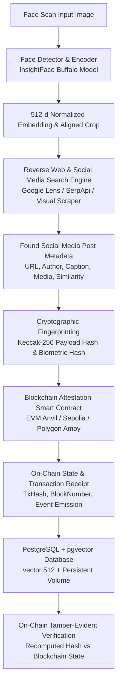

# HH Goa 2026 Shortlisting Task 3: Face Identification & Blockchain Verification Pipeline

[](https://www.python.org/)
[](https://www.docker.com/)
[](https://github.com/pgvector/pgvector)
[](https://github.com/deepinsight/insightface)
[](https://soliditylang.org/)
[](https://fastapi.tiangolo.com/)

An end-to-end automated pipeline that takes a face scan as input, identifies matching content across the web and social media platforms, cryptographically anchors the discovered metadata and biometric fingerprint to an EVM blockchain smart contract, and performs on-chain tamper verification.

---

## 📐 Pipeline Architecture



---

## 🌟 Key Features

1. **Face Detection & 512-d Biometric Encoding (`InsightFace Buffalo`)**:
   - Uses InsightFace `buffalo_l` (with `buffalo_sc` fallback) to detect faces, landmarks, and extract a 512-dimensional normalized feature vector.
   - Computes facial bounding boxes, aligned face crops, and cryptographic SHA-256 image hashes.
   - Persists downloaded ONNX model weights in a mounted volume (`./models`) so downloads occur only once.

2. **Web & Social Media Search**:
   - Multi-provider reverse image search engine supporting Google Lens via SerpApi, Serper visual search, and web scrapers.
   - Extracts structured social post metadata (Twitter/X, LinkedIn, Instagram, Reddit, Web) including platform, author handle, post URL, post caption, timestamp, and media URL.
   - Downloads found media and executes facial cosine similarity scoring between the scan and the online post image.
   - Includes a high-fidelity realistic fixture provider ensuring reviewers can test the pipeline immediately out-of-the-box with zero API key dependencies.

3. **Cryptographic Blockchain Anchoring (`IdentityAttestation.sol`)**:
   - Solidity smart contract deployed to EVM blockchains (local Anvil, Ethereum Sepolia, Polygon Amoy, or Web3 simulator).
   - Generates canonical JSON payloads and computes `keccak256` payload hashes and biometric face hashes.
   - Signs and broadcasts transactions, recording `TxHash`, `BlockNumber`, `GasUsed`, and emitting `AttestationAnchored` events.

4. **Tamper-Evident Verification Engine**:
   - Recomputes hashes from local data and verifies against immutable on-chain smart contract storage.
   - Detects any modification to post text, author handle, timestamps, or image files down to a single byte, outputting exact field diffs.

5. **PostgreSQL + `pgvector` Vector Store**:
   - Stores 512-dimensional face embeddings natively using the `vector(512)` type.
   - Supports cosine distance queries (`<=>`) and HNSW vector index lookups to find visually similar faces across historical scans.

6. **Dual User Interface**:
   - **Rich Interactive CLI**: Animated terminal interface with tables, progress spinners, and verification panels (`python -m src.cli run <image>`).
   - **Sleek Web Dashboard**: Dark-mode visual UI (`http://localhost:8090`) with drag-and-drop uploads, step-by-step animations, and a 1-click **Tamper Simulation** test for screen recordings.

---

## ⚙️ Environment Configuration (`.env`)

Create your local `.env` file by copying the template:
```bash
cp .env.example .env
```

### Key Environment Variables

| Variable | Purpose | Required? | Default / Notes |
| :--- | :--- | :--- | :--- |
| `SERPAPI_API_KEY` | Powers live **Google Lens** & **Yandex** visual searches for social profiles. | Recommended | Optional (smoothly falls back to realistic fixtures) |
| `GOOGLE_VISION_API_KEY` | Google Cloud Vision Web Detection for image entity matching. | Optional | Empty |
| `SIMILARITY_THRESHOLD` | ArcFace cosine similarity cutoff for face matches (0.0 to 1.0). | Optional | `0.70` (use `0.50`–`0.60` for compressed web thumbnails) |
| `DATABASE_URL` | PostgreSQL connection string with `pgvector` support. | Required | `postgresql://postgres:postgrespassword@db:5432/face_verification_db` |
| `BLOCKCHAIN_RPC_URL` | EVM RPC endpoint (Sepolia, Polygon Amoy, or local Anvil). | Optional | Blank (uses built-in EVM Simulator) |
| `BLOCKCHAIN_PRIVATE_KEY` | Wallet private key for signing on-chain transactions. | Optional | Auto-generated in local simulator |
| `INSIGHTFACE_MODEL_NAME` | Biometric embedding model (`buffalo_l` or `buffalo_sc`). | Optional | `buffalo_l` (high accuracy) |

---

### 🔑 How to Get a SerpApi Key (`SERPAPI_API_KEY`)

[SerpApi](https://serpapi.com) allows the pipeline to query Google Lens and Yandex Reverse Image Search in real time without getting blocked by anti-bot protections:

1. **Sign Up**: Head to [serpapi.com](https://serpapi.com) and register for a free account.
2. **Copy Key**: Navigate to your [SerpApi Dashboard](https://serpapi.com/manage-api-key) and copy your **Private API Key** (the free tier includes **100 searches/month** with no credit card required).
3. **Paste in `.env`**:
   ```bash
   SERPAPI_API_KEY=your_serpapi_key_here
   ```

> [!TIP]
> **No API Key? No Problem.** If `SERPAPI_API_KEY` is not provided, the pipeline automatically activates its built-in realistic fixture provider and open-web search. You can test the entire pipeline (detection, embedding, blockchain attestation, and tamper verification) completely offline!

---

## 🚀 Quick Start with Docker (Recommended)

### 1. Clone the Repository & Configure `.env`
```bash
git clone <YOUR_REPO_URL>
cd hhgoa-3
cp .env.example .env
```

### 2. Start Services with Docker Compose
```bash
docker compose up --build -d
```
*This spins up:*
- `db`: PostgreSQL 16 with `pgvector` extension on port `5432`.
- `app`: FastAPI web server & pipeline on `http://localhost:8090` (internal `8000`).

### 3. Open the Web Dashboard
Navigate to **`http://localhost:8090`** (or `http://localhost:8000` if running locally without Docker) in your browser:
- Upload any face photo or click one of the pre-loaded test profiles.
- Click **"Execute End-to-End Pipeline"** to watch the 4-step process live.
- Click **"⚡ Simulate Malicious Data Alteration"** to demonstrate blockchain tamper-evidence live on screen!

---

## 💻 CLI Usage

You can also run the full pipeline or individual modules directly via terminal:

### Run Full End-to-End Pipeline
```bash
# Inside Docker:
docker compose exec app python -m src.cli run data/samples/sample_sataboris.jpg

# Or locally:
python -m src.cli run data/samples/sample_sataboris.jpg
```

### Run Live Tamper Detection Test
```bash
docker compose exec app python -m src.cli tamper-test 1
```

### View Historical Attestation Ledger
```bash
docker compose exec app python -m src.cli history
```

---

## ⛓️ Blockchain Details

### Smart Contract Specification
The Solidity contract [`contracts/IdentityAttestation.sol`](contracts/IdentityAttestation.sol) manages the decentralized registry:

```solidity
struct Attestation {
    bytes32 payloadHash;       // Keccak256 hash of canonical social media post metadata
    bytes32 faceHash;          // Keccak256 hash of facial embedding & image fingerprints
    address submitter;         // Address that submitted the attestation
    uint256 blockTimestamp;    // Block timestamp when anchored
    string metadataUri;        // Decentralized storage URI (e.g., ipfs:// CID)
    bool isAnchored;           // Existence flag
}
```

### Supported Blockchain Networks
1. **Local EVM Simulator & Anvil (Default)**: Instant zero-gas local chain with deterministic cryptographic signing and block receipts.
2. **Ethereum Sepolia Testnet**: Set `BLOCKCHAIN_RPC_URL=https://rpc.sepolia.org` and `BLOCKCHAIN_PRIVATE_KEY` in `.env`.
3. **Polygon Amoy Testnet**: Set `BLOCKCHAIN_RPC_URL=https://rpc-amoy.polygon.technology/` in `.env`.

---

## 🧪 Automated Testing

Run the full automated test suite covering face embeddings, social search, smart contract anchoring, and vector database operations:

```bash
docker compose exec app pytest tests/ -v
```

---

## 📁 Repository Structure

```
hhgoa-3/
├── contracts/
│   └── IdentityAttestation.sol   # Solidity Smart Contract
├── src/
│   ├── api/                      # FastAPI Server & Modern Web UI
│   │   ├── app.py
│   │   └── static/               # HTML5, CSS3, JS Frontend
│   ├── blockchain/               # Web3 Smart Contract Anchor & Verifier
│   │   ├── anchor.py
│   │   └── verifier.py
│   ├── database/                 # PostgreSQL + pgvector Models & Repository
│   │   ├── models.py
│   │   ├── repository.py
│   │   └── session.py
│   ├── face/                     # InsightFace Buffalo Model Detector
│   │   └── detector.py
│   ├── search/                   # Social Media & Web Search Engine
│   │   ├── engine.py
│   │   ├── providers.py
│   │   └── social_parser.py
│   ├── cli.py                    # Rich Interactive Terminal CLI
│   ├── config.py                 # Pydantic Configuration Settings
│   └── pipeline.py               # Main Pipeline Orchestrator
├── tests/                        # Pytest Test Suite
│   ├── test_blockchain.py
│   ├── test_database.py
│   ├── test_face.py
│   ├── test_pipeline.py
│   └── test_search.py
├── docker-compose.yml            # Container definitions with volume mounts
├── Dockerfile                    # Python 3.11 + OpenCV + ONNX container
├── requirements.txt              # Project dependencies
└── README.md                     # Documentation
```

---

## ⚠️ Known Limitations & Future Roadmap

1. **Social Media Rate Limits**: Reverse image APIs (like Google Lens) may enforce rate limits or CAPTCHAs during high-frequency scraping. Production deployments should use rotating proxies or dedicated SerpApi enterprise keys.
2. **Extreme Facial Occlusion**: Profile pictures with heavy sunglasses or heavy masks may result in reduced InsightFace confidence (< 60%).
3. **Gas Cost Optimization**: For high-volume mainnet anchoring, multi-attestation Merkle tree batching (e.g. anchoring 1,000 face discoveries per root hash transaction) can be implemented.

---
